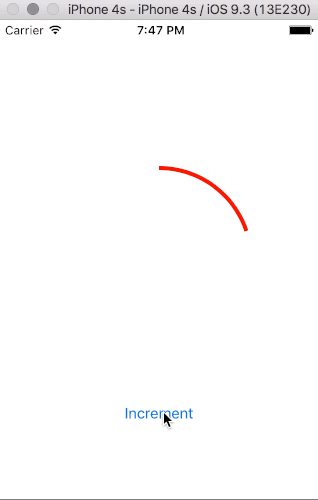

# Ring

Ring is... well, a ring. A UIView subclass that tries to mimic a single activity ring in the Health app and can be used as a progress indicator.

# Integrating Ring in your project

As far as I know, the Swift Package Manager can not manage UIkit dependencies. So, checkout the project, and drag Ring.swift into your Xcode project. The project contains a sample app to showcase how to use Ring